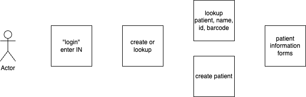
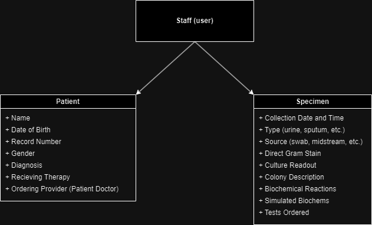

# Antibiotics System - Northern Michigan University
## Overview
The clinical sciences department creates antibiotic reports based on micro-organisms to find MIC's for patient treatment. Right now, they do this process by pen and paper. While it gets the job done, it has proven to be ineffective and an inaccurate representation of the industry. 

There are two main issues at hand.
1. In a hospital, you would fill out the forms digitaly rather than on pen and paper.
2. Finding the history of these forms is inefficent and, once again, an inaccurate representation of industry.

## System expectations

A birdseye solution is as follows:

1. Have the Specimen Requisition and Work Card forms digitalized and placed on the computer.
2. The information present in the forms would be represented as a barcode that can be printed out. 
3. The barcode can be scanned to add more information or view current information on the computer.

This results in a professional way for students to document patient and specimen info. Additionally, the students gain real world application as if they were working in the hospital itself.

## Entities
- **Staff** (user) - Student or faculty. 
 - **Patient**
    - *name* (string) - Last name, First name
    - *dateOfBirth* (date) - Date of birth in MM/DD/YYYY format.
    - *medicalRecordNumber/ PatientID* (integer) - 6 digit patient medical record number 
    - *gender* (boolean) - M of F 

- **Specimen**
    - *diagnosis* (string) - Why did the patient come in / what is the condition. 
        - Examples inculude: Sore in mouth, Annual check up.
    - *isReceivingTherapy* (boolean) - is the patient recieving antimicrobial therapy at the time of collection?
    - *source* (enum) - What type is the specimen (CSF, Urine, Sputum etc.)
    - *orderingProvider* (string) - Who the ordering provider is.
        - Examples include: Dr. Renaldi, Dr. Mann, Dr. Thunell, etc.
    - *collectionDate* (date) - Date collected in MM/DD/YYYY
    - *collectionTime* - Collection time in military time
    - *testOrdered* (string) - What kind of test was ordered for the patient?
    - *directGramStain* (list of ints) - Test that checks to see if you have a bacterial infection / help identify it. How many x were seen, where x is either WBCs, EPIs, GPC, GPB, GNC, GNB, or Other. 
    - *cultureReadout* (list of structs) - read out cultures each day until they can be finalized. 
        - date (date) - MM/DD/YYYY
        - time (time) - Military time
        - criticalResults - Document if a result was "critical" and called directly to the provider.
    - *colonyDescription* (string) - physically describe the colonies.
    - *biochemicalReactions* (string) - list all biochemical testing performed and what the results were.
    - *simulatedBiochems* (struct) - These are simulated tests to demonstrate ideas about tests that the students cannot run. Students write the results in to demonstrate their understanding of these tests.
        - testName (string) 
        - describeInoculation 
        - temperature (integer)
        - duration (string) 
        - atmosphericConditions
        
## Entity relation diagrams




## Queries

**Q1** - View Patients - Show all patients in the system for admins or patients assigned to students.

**Q2** - View Specimen Requisition | Parameters: SpecimenID - Shows the Specimen Requisition form for specimen in progress at the lab.

**Q3** - View Work Card | Parameters: SpecimenID - Shows the work card for the specified specimen and patient.

## Events

- Add new Patient - Opens a blank form to create a patient in the system. Button provided to auto generate information.

- Edit Patient Information - Shows the form to edit patient information.

- Edit Specimen Requisition Form - Specimen Requistion form is only able to be editted by admins.

- Edit Specimen Work Card - Shows the form to edit specimen information.

- Remove Patient - Allows admin to delete the selected patient. 

- Remove Specimen - Allows admin to delete the selected specimen. 

## Platform

**R1** - The software will be installed on the computer inside of the clincal science lab room The software will be compatable with: Windows 7, Windows 8, Windows 10, Windows 11.

**R2** - The software will be compatable with a barcode printer and barcode scanner to produce the specimen barcodes.

## User permissions

**R3** - Admin can view all Patient info.

**R4** - Sign in will be NMU ID Scan.

**R5** - Before each semester starts all students, and specimen will be cleared off the computer.

Users can interact with the software differently depending on if they are faculty or students.

| Event                    |  Admin  | Student |
| ------------------------ | :-----: | :-----: |
| View Pateint Info        |    ✔    |    ✔    |
| Add new Patient          |    ✔    |         |
| Edit Patient Info        |    ✔    |         |
| View all Patients        |    ✔    |         |
| View Specimen Info       |    ✔    |    ✔    |
| Add new Specimen         |    ✔    |    ✔    |
| Edit all Specimen        |    ✔    |         |
| Edit user owned Specimen |    ✔    |    ✔    |
| View all Specimen        |    ✔    |         |

## Security

**R5** - All non-admin users have a copy of patients and specimen.

## Technologies Used


## Setup
1. navigate to parent directory of github repo
2. from parent directory, run
```python3 Antibiotics/src/db/rebuild.py```
from terminal
